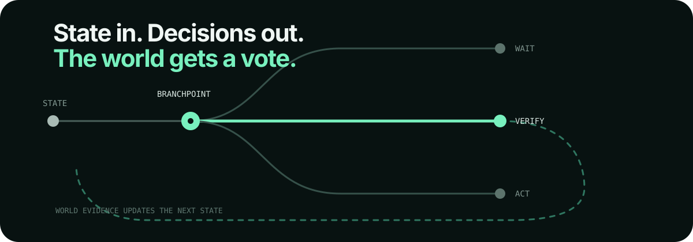

<div align="center">

# Branchpoint

### Model intent is not execution authority.

**A control layer for AI agents that must act under uncertainty.**  
**The model proposes. Branchpoint decides what is safe, informative, and worth doing next.**

[](https://github.com/hippoley/CausalRAG/actions/workflows/ci.yml)
[](https://github.com/hippoley/CausalRAG/actions/workflows/pages.yml)


[](https://github.com/hippoley/CausalRAG/stargazers)

[**Live verified replay**](https://hippoley.github.io/CausalRAG/) · [**Verified examples**](https://hippoley.github.io/CausalRAG/examples.html) · [**Quickstart**](#60-second-quickstart) · [**Capability packs**](docs/capability-packs.md)


</div>

<p align="center">
  
</p>

### Pick a path

| I want to… | Start here |
| --- | --- |
| **see the idea in 30 seconds** | [Live verified replay](https://hippoley.github.io/CausalRAG/) |
| **see three real decision trajectories** | [Verified examples](https://hippoley.github.io/CausalRAG/examples.html) |
| **run it locally without an API key** | [60-second quickstart](#60-second-quickstart) |
| **drop one decision boundary into my code** | [Minimal Python example](#put-one-decision-point-into-existing-code) |
| **bring my own domain** | [Capability packs](docs/capability-packs.md) |
| **try to break the runtime** | [Open a failure case](https://github.com/hippoley/CausalRAG/issues/new?template=failure-case.yml) |

---

## Why this exists

Most agent loops collapse **proposal, policy, uncertainty, execution authority, and verification** into one model response:

```text
model → tool → model → tool → answer
```

Branchpoint inserts an explicit decision boundary:

```text
model proposes
      ↓
candidate actions
      ↓
risk · probability · information value · cost · timing
      ↓
choose / verify / wait / ask / intervene / stop
      ↓
world observation
      ↓
belief update
      ↓
next branch
```

The point is not to make the model sound more confident.

The point is to let software **inspect why an action is allowed, delay action when evidence is weak, and change course when reality disagrees.**

---

## Proof before promises

A deterministic CI fixture runs the **same frozen world twice**:

```text
same hidden mechanism
same seed
same goal
same tools
same budget
same proposer
```

Only the control layer changes.

| same world | proposal-order loop | Branchpoint |
| --- | --- | --- |
| first move | `submit_form` | `inspect_submission_state` |
| execution boundary | crossed immediately | verified first |
| next step | wrong external action | `reauthenticate` |
| result | **failed** | **success** |

The test records the **first trajectory divergence** instead of comparing unrelated prompts and calling that an evaluation.

Run the exact fixture:

```bash
pytest -q tests/test_playable_probe_api.py::test_probe_compare_api_runs_same_world_causal_and_vanilla_arms
```

A separate seeded suite contains **30 episodes** across three hidden mechanisms and ten seeds:

| policy snapshot | success | mean regret |
| --- | ---: | ---: |
| neutral one-step decision value | **0.833** | **0.251** |
| wrong-action loss = 1.0 | **0.900** | **0.216** |

> These are repository benchmark numbers for fixed environments, **not claims about arbitrary external agent tasks**.

---

## 60-second quickstart

No model key required.

```bash
git clone https://github.com/hippoley/CausalRAG.git
cd CausalRAG
pip install -e ".[api]"

python examples/browser_action_guard_demo.py
```

Expected shape:

```text
same world: True
first divergence: 0
proposal-order loop: submit_form -> success= False
decision runtime: inspect_submission_state -> reauthenticate -> success= True
```

Then open the local workbench:

```bash
branchpoint probe --open
```

> The repository URL is still `/CausalRAG` for link compatibility. The public runtime identity is **Branchpoint**, and the Python package / CLI is `branchpoint`.

Surfaces:

```text
/            product entrance
/decide      bring-your-own-decision lab
/demo        verified trajectories
/workbench   live agent history + human steering
/research    score / trace / counterfactual console
```

---

## Put one decision point into existing code

```python
from branchpoint import ActionKind, CandidateAction, ToolSpec, decide

decision = decide(
    [
        CandidateAction(ActionKind.INTERVENE, "submit_form", expected_goal_gain=0.95),
        CandidateAction(
            ActionKind.OBSERVE,
            "inspect_submission_state",
            expected_goal_gain=0.15,
            expected_information_gain=0.70,
        ),
    ],
    tools=[
        ToolSpec("submit_form", "External submit", lambda: None, risk=0.72, reversible=False),
        ToolSpec("inspect_submission_state", "Read-only check", lambda: None, cost=0.02),
    ],
)

print(decision.selected.name)
# inspect_submission_state
```

The proposer can still rank actions. Canonical tool policy remains in code.

---

## What Branchpoint gives you

| capability | what becomes explicit |
| --- | --- |
| **Typed actions** | observe, intervene, wait, ask, stop |
| **Uncertainty** | probabilities, confidence, model mismatch |
| **Decision value** | expected utility, information gain, EVSI, cost |
| **Execution gates** | risk, irreversibility, human approval |
| **World correction** | observations update beliefs and hypotheses |
| **Replay** | same-world A/B, first divergence, counterfactual forks |
| **Observability** | score provenance, traces, telemetry, agent history |

Typical surfaces:

`tool routing` · `browser actions` · `incident diagnosis` · `device control` · `semantic routing` · `workflow triage` · `code repair` · `agent evaluation`

---

## What Branchpoint is — and is not

Branchpoint is a **runtime decision layer** for bounded choices inside agent workflows.

It is **not**:

- a prompt that asks the model to critique itself;
- a guarantee that an autonomous agent is safe;
- a replacement for your model, planner, or orchestration framework;
- a claim that every task should be Bayesian;
- a benchmark built from unrelated prompts with cherry-picked outputs.

It is useful when a system must answer questions such as:

> **Should I act now, buy more evidence, wait, ask a human, or stop?**

and you want that answer to be inspectable in code.

---

## One project, one identity

**Branchpoint is the public runtime and product identity.**  
The repository remains at `hippoley/CausalRAG` for link compatibility; `branchpoint` is the Python package / CLI.

The repository started with causal retrieval experiments. The durable idea was not “RAG” itself; it was **making hidden assumptions, causal structure, evidence, and decision boundaries explicit enough to test**. Branchpoint is that idea pushed into agent execution.

---

## Jev + Branchpoint

Jev and Branchpoint solve different parts of the same problem.

**Jev proposes a typed probabilistic choice. Branchpoint decides whether that proposal has execution authority.**

```python
from branchpoint import ActionKind, CandidateAction, ToolSpec, jev_then_branchpoint

candidates = [
    CandidateAction(
        ActionKind.INTERVENE,
        "submit_form",
        expected_goal_gain=0.95,
        rationale="Submit the form now.",
    ),
    CandidateAction(
        ActionKind.OBSERVE,
        "inspect_submission_state",
        expected_goal_gain=0.15,
        expected_information_gain=0.70,
        rationale="Check session state before an irreversible submit.",
    ),
]

jev, decision = jev_then_branchpoint(
    {"session_status": "unknown"},
    candidates,
    tools=[
        ToolSpec("submit_form", "External submit", lambda: None, risk=0.72, reversible=False),
        ToolSpec("inspect_submission_state", "Read-only check", lambda: None, cost=0.02),
    ],
)

print("Jev proposes:", jev.selected_name)
print("Branchpoint authorizes:", decision.selected.name)
```

The bridge deliberately does **not** copy Jev confidence into canonical risk or permission policy. Model probabilities are evidence; application-owned tool policy remains code.

Use Jev for fast semantic judgments when the answer space is bounded. Use Branchpoint when the system also needs execution gates, state transitions, evidence acquisition, human approval, temporal attribution, or replay.

---

## Where this fits

CausalRAG is useful anywhere an agent has to make **small, consequential decisions inside otherwise deterministic software**:

| decision | example |
| --- | --- |
| **choose** | which tool, skill, route, document, browser action, or recovery path |
| **score** | risk, urgency, relevance, quality, expected utility |
| **gate** | auto-execute, verify, ask a human, wait, or stop |
| **verify** | did the action actually cause the observed result? |
| **revise** | does the current hypothesis set still explain the world? |

Typical surfaces include:

`tool selection` · `semantic routing` · `browser actions` · `incident diagnosis` · `device control` · `workflow triage` · `code repair` · `context selection` · `agent evaluation`

The point is not to replace your model.

The point is to stop making one model response carry **proposal, policy, uncertainty, execution authority, and verification** all at once.

---

## Why not a plain agent loop?

| Ordinary loop | CausalRAG |
| --- | --- |
| State lives mostly in prompt history | Beliefs and hypotheses are first-class runtime state |
| Model output directly drives the next tool | Model proposes; runtime validates and arbitrates |
| Tool results become more text | Observations can update explicit probabilities |
| Every observation is treated as usable | Temporal attribution can reject stale evidence |
| Hypothesis set stays implicit | Model mismatch can admit a new explanation |
| Human approval is bolted on | Human gates are part of the execution protocol |
| Debugging ends at logs | Every step can be inspected and forked |
| Evaluation asks “did it answer?” | Same-world runs measure trajectory differences |

The goal is not maximum autonomy. It is **explicit execution authority at the branch where a wrong choice becomes expensive**.

---

## Six capability packs you can run

The fastest way to understand CausalRAG is to watch one bounded decision change the trajectory.

| pack | the decision |
| --- | --- |
| **Browser action guard** | The proposer puts **Submit** first. The runtime sees risk + irreversibility and verifies session state before crossing the execution boundary. |
| **Ambiguous tool routing** | Decide whether a request needs private data, fresh public information, or a state-changing path that should escalate. |
| **Production incident triage** | Choose which observation is worth buying before rollback, DB mitigation, or dependency failover. |
| **HVAC hidden mechanism** | Choose diagnostic evidence under a probe budget, then act on the leading mechanism. |
| **Delayed effect** | Reject a fresh-looking measurement until the causal window makes it attributable to the intervention. |
| **Unknown mechanism** | Stop reweighting a broken hypothesis set and admit a new explanation when reality no longer fits. |

The first three are designed to look like ordinary software work. The last three expose deeper runtime behavior.

A useful starting point is **Browser action guard** because the first divergence is visible immediately:

```text
proposer order:  submit_form → inspect_submission_state
plain loop:      submit_form → wrong external action
CausalRAG:      inspect_submission_state → reauthenticate → success
```

Same goal. Same hidden state. Same candidates. Different execution authority.

---

## The live workbench

The workbench is built around **Agent History**, not a chat transcript.

Each row is one correction loop:

```text
BEFORE
H2 · 44%
   ↓
ACTION
airflow_test
   ↓
WORLD
window flow present, cross-room pressure ≈ 0
   ↓
AFTER
H2 · 78%
```

When the structure changes, the UI says so explicitly:

```text
WORLD MODEL CHANGED
new hypothesis: H4
```

### Manual mode

Pause before every execution.

Useful for debugging, teaching, and inspecting every branch.

### Safe Auto

Low-risk evidence actions can continue automatically.

The runtime pauses when the next branch deserves attention, for example:

- an intervention is about to execute;
- risk or irreversibility rises;
- runtime arbitration diverges from the proposer;
- a new hypothesis appears;
- model mismatch is detected;
- a human starts steering the session.

The goal is not “full autonomy.”

The goal is **attention at the right branch**.

---

## A decision is inspectable

A runtime decision keeps the pieces separate:

```text
prior state
candidate actions
runtime-valid candidates
score provenance
selected action
human override, if any
world observation
posterior state
structural hypothesis changes
telemetry
counterfactual branch
```

That separation matters because it lets you ask useful questions after the run:

- Did the model propose a bad action?
- Did the runtime score it incorrectly?
- Was the observation noisy?
- Did the belief update overreact?
- Did a human override improve or harm the trajectory?
- What would have happened if we chose candidate #2 instead?

---

## Capability packs

The CausalRAG workbench does not hard-code one domain.

A capability pack defines the pieces needed for one decision environment:

```text
world
+ tools
+ hypotheses
+ experiment contracts
+ intervention contracts
+ defaults
+ metrics
```

The frontend reads available packs from `/api/config`.

Add a new pack to the registry and it appears in the workbench without rewriting the UI.

Current packs include:

- hidden-world ventilation diagnosis;
- delayed-effect temporal attribution;
- open-world model mismatch.

This is the extension point for incident response, operations, device control, deployment diagnosis, support routing, evaluation workflows, and domain-specific agent systems.

---

## External models

The `branchpoint` runtime package can use a deterministic proposer, a small local model, or a hosted model.

```bash
export OPENAI_API_KEY=...
export ANTHROPIC_API_KEY=...
export LOCAL_LLM_URL=http://localhost:1234/v1

export BRANCHPOINT_SMALL_MODEL=local-model
export BRANCHPOINT_FRONTIER_MODEL=<your-model>
```

The proposer can suggest hypotheses and candidate actions.

It does **not** own:

- the canonical belief state;
- runtime validity;
- temporal guards;
- Bayesian updates backed by declared likelihoods;
- capability costs;
- intervention utility;
- human approval.

Those stay in application code.

---

## Declaring evidence

When you know how an experiment behaves under competing hypotheses, declare it.

```python
from branchpoint.experiments import ExperimentContract, OutcomeLikelihood

pressure_test = ExperimentContract(
    experiment_id="filter_pressure_test",
    outcomes=[
        OutcomeLikelihood("high",   {"H1": 0.90, "H2": 0.15}),
        OutcomeLikelihood("normal", {"H1": 0.10, "H2": 0.85}),
    ],
)
```

Now the runtime can compute the expected information gain before the probe and the exact posterior after the outcome.

No second model call is required to “reinterpret” the same evidence.

---

## Human steering is state, not magic

At a live gate you can:

```text
approve the runtime choice
choose another runtime-valid candidate
add a provisional hypothesis
send operator context
request a replan
```

A human message does not automatically become evidence.

A human-selected action does not bypass runtime validity.

That boundary is deliberate.

---

## Counterfactuals

Completed steps can be replayed from a frozen state with another candidate.

The fork rebuilds the same environment, reapplies runtime guards, follows the alternate branch, and reports the first future divergence.

This makes “what if we had chosen the other tool?” a runtime operation instead of a storytelling exercise.

---

## Same-world evaluation

CausalRAG includes paired runs where both policies receive the same:

```text
hidden mechanism
seed
goal
tools
budget
proposer configuration
```

Only the runtime capability profile changes.

That lets tests identify **where the trajectories first diverge**, not merely whether the final text is different.

CI covers deterministic and seeded environments, temporal attribution, open-world discovery, human gates, counterfactual forks, proposer audit, API surfaces, Docker smoke tests, and verified example replays.

---

## Project layout

```text
branchpoint/
├── agent/          decision loop, runtime arbitration, temporal effects
├── experiments/    likelihoods, information value, model mismatch
├── world_model/    hypotheses, beliefs, evidence, transitions
├── tools/          typed tool registry
├── reasoning/      proposer and hypothesis generation
├── probe/          sessions, examples, A/B, counterfactuals
├── observability/  trace + OpenTelemetry
├── interface/      FastAPI surfaces
└── templates/      examples, workbench, research console
```

---

## Install

Python 3.10+.

```bash
pip install -e .
```

Optional surfaces:

```bash
pip install -e ".[api]"               # FastAPI workbench
pip install -e ".[observability]"     # OTLP export
pip install -e ".[retrieval]"         # document evidence adapters
pip install -e ".[local-embeddings]"  # local embedding models
pip install -e ".[faiss]"             # FAISS vector backend
pip install -e ".[evaluation]"        # evaluation extras
pip install -e ".[full]"              # hosted capability layers
```

---

## Design principle

> **The model proposes. The runtime decides. The world corrects both.**

CausalRAG is deliberately opinionated about three things:

1. **A probability is more useful than confident prose when software must branch.**
2. **Execution authority belongs to the runtime, not to the proposer.**
3. **Reality must be able to change both the probabilities and the hypothesis set.**

If that resonates, try the examples, break a capability pack, add a strange environment, or open an issue with a failure mode you want the runtime to survive.

---

## Contributing

**The easiest way to contribute is to bring a failure.**

If an ordinary agent loop takes the wrong branch, open a [Failure case](https://github.com/hippoley/CausalRAG/issues/new?template=failure-case.yml). If you already have a reproducible world + tools + hypotheses, propose a [Capability pack](https://github.com/hippoley/CausalRAG/issues/new?template=capability-pack.yml). If you built something public with CausalRAG, share it through the [Showcase](https://github.com/hippoley/CausalRAG/issues/new?template=showcase.yml).

Small, falsifiable contributions are preferred over large speculative rewrites.

Good first contributions include:

- a new capability pack with a hidden-world test;
- a tool contract with explicit cost / risk / reversibility;
- a failure case where a normal loop takes the wrong branch;
- a new same-world comparison;
- a better visualization of one decision;
- a counterexample that breaks an existing guard.

See `CONTRIBUTING.md`.

---

## License

Apache License 2.0. See [`LICENSE`](LICENSE).
